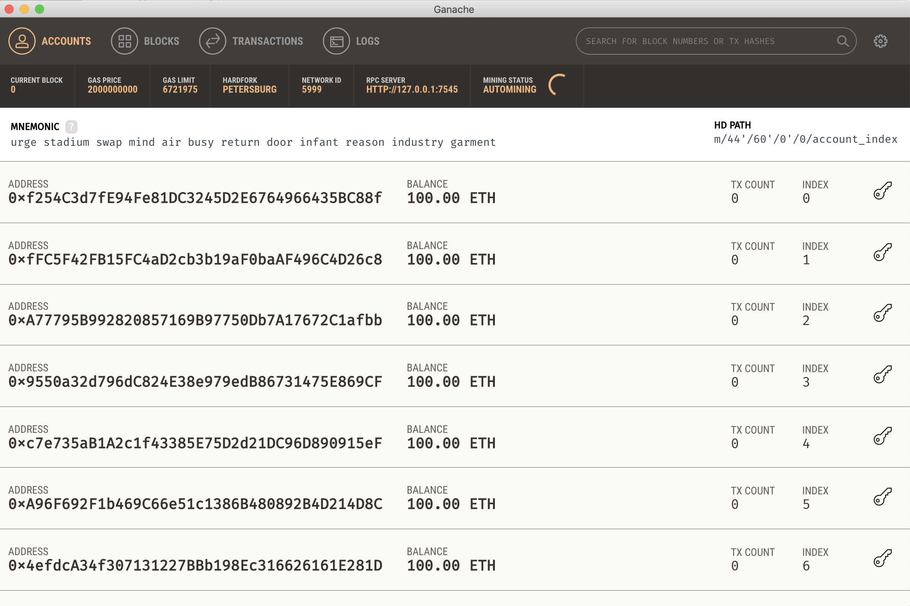
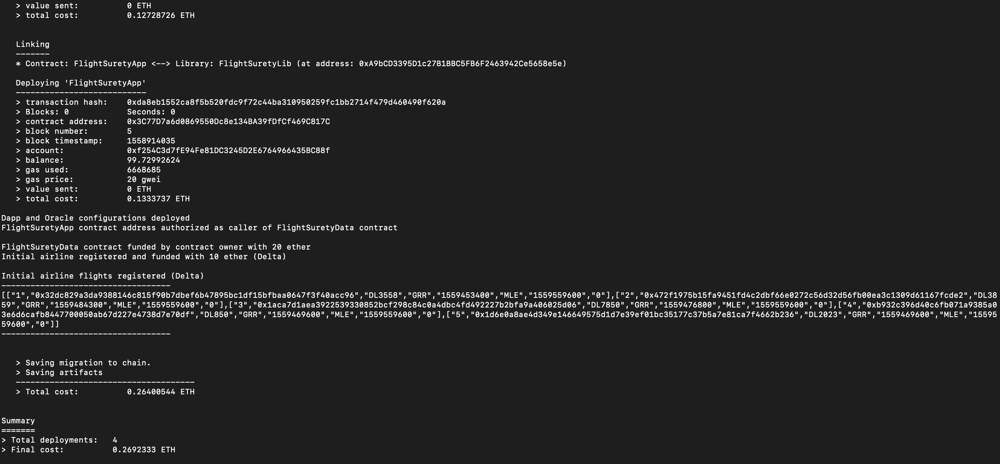
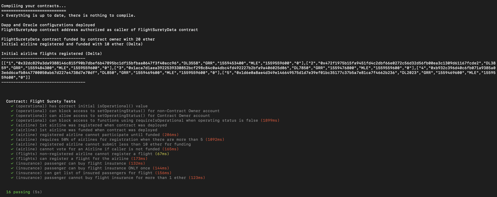
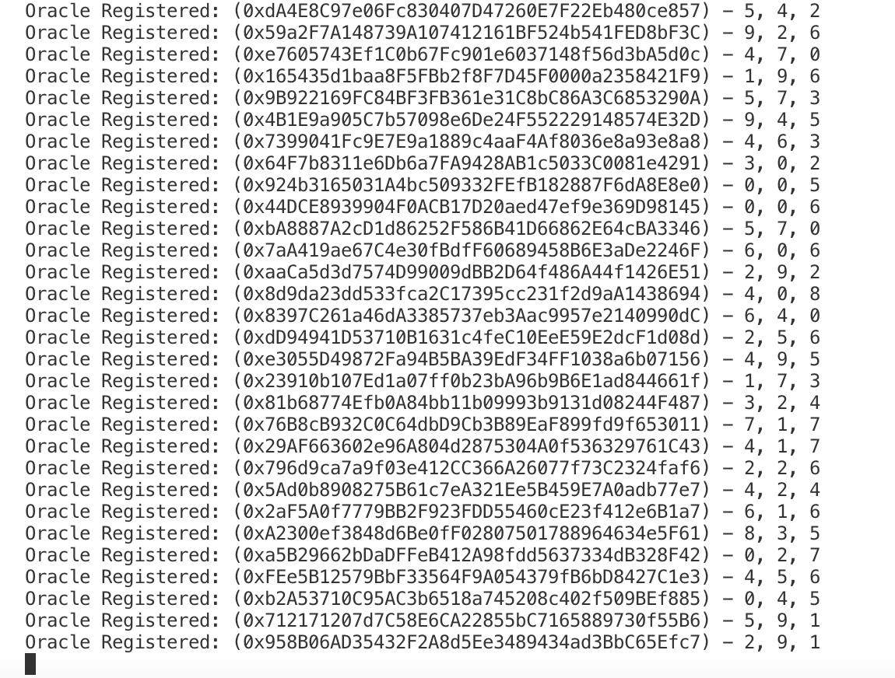

# FlightSurety - Udacity Project
*a decentralized flight insurance sample application that incorporates Oracles and smart contracts to issue passenger payouts for delayed flights*

## Description
This repository contains an Ethereum DApp that demonstrates various aspects of a blockchain-based Flight Insurance program. The application architecture has these components:
* FlightSurety UI (DApp)
* Ethereum Smart Contracts with separation of concerns: Business/App and Data contracts
* Server application for Oracle flight status request/response simulation

## Airlines
On deployment there is one Airline already registered and funded, and has a set of flights. You can use the DApp to register additional airline accounts. The 1st truffle ganache account is used for the deployment of the smart contracts and is the contract owner. The 2nd account is used to add and register the initial airline, Delta, and Delta Flights.


* Only existing (already registered) airlines can register a new airline, up to four airlines.
* After there are at least four airlines registered, the fifth airline will require that multi-party consensus of 50% of registered airlines before it's approved.
* An airline cannot participate in the FlightSurety program until it has submitted funding of 10 ether. You can use the DApp to fund a new airline, by clicking on the `Send Funds` button.

## Flights
The FlightSurety Data contract is setup on deployment with five pre-registered flights. You can use the DApp to add more flights or use the passengers section to select an existing flight.


* A passenger can purchase flight insurance up to 1 ether.

## Oracles and Processing Flight Status Updates
The FlightSurety DApp simulates 20+ Oracle accounts by registering and paying a fee of 1 ether to the FlightSuretyApp Contract. Once registered via the Oracle server simulator you can use the DApp UI to trigger the request for flight status information. The registered Oracles watch for the OracleRequest event and respond based on at least one match of their index to the request's index values. 

After at least three of the same responses are received by the FlightSuretyApp contract, the request is accepted as the flight status and the request is closed. Any additional Oracle reports will be rejected.

To trigger the Oracle flight status request, click on the `Submit to Oracles` button. You may need to do the request more than once before a 'late' status event is emitted.

When it's determined via the Oracles that a flight is delayed, the FlightSuretyApp contract will automatically go through the list of insured passengers for the airline/flight and will issue a payout of 1.5X the original purchase. The InsurancePassengerPayout event is emitted and the passenger's FlightSurety account is credited with the payout.

The passenger is then able to initiate the payout withdrawal to transfer the funds to their account or wallet address. Use the `Withdraw Payout` button in the DApp UI and your Ganache accounts to observe the transfer of funds to the passenger account. The sample application uses the 7th Ganache account for the passenger processing.

## Getting Started

These instructions will get the project up and running in your local development environment.

### Prerequisites

Install Truffle and Ganache. 

```
npm install -g truffle@5.0.17
```
Modify your Ganache settings so that it has 50 accounts, each starting with 100 ether. Between the number of accounts needed for the airlines, passengers, Oracles and testing, you'll need that.


### Installing

Clone this repository:

```
git clone [repo]
```

Change directory to the ```flight-surety``` folder and install all requisite npm packages (as listed in ```package.json```):

```
cd flight-surety
npm install
```

Launch Ganache:




In a separate terminal window, Compile and migrate smart contracts to the locally running blockchain (Ganache):

```
truffle migrate --reset
```




This will create the smart contract artifacts in the ```build/contracts``` folder.

### Testing the FlightSurety DApp with Oracles

Run the DApp FlightSurety tests:

```
cd flight-surety
```

```
truffle test test/flightSurety.js
```




Run the Oracle server tests:

```
truffle test test/oracles.js
```


All tests should pass.

### Register the Oracles with the FlightSuretyApp Contract

In a separate terminal window, start the Oracle server app:

```
cd flight-surety/src/server
```

```
npm run server
```

The Oracle server implements a REST API. To view the main server page:

```
http://localhost:3000
```


Use the API to tell the Oracles to register:

```
http://localhost:3000/api/oracles/register
```

You should see the following response:


In the terminal window where you started the Oracle server, watch them all register with the FlightSuretyApp contract:




## Interacting with the FlightSurety DApp

Run the local development server to start the FlightSurety DApp, which will launch the UI in your browser.

In a separate terminal window, start the FlightSurety DApp:

```
cd flight-sureity/src/dapp
```

```
npm run dapp
```

## Packages

* web3js
* truffle
* truffle-assertions
* truffle-hdwallet-provider
* open-zeppelin
* webpack

## Attribution

Adapted from the [Udacity FlightSurety](https://github.com/udacity/FlightSurety) project.

## Versions

* Truffle v5.0.17 (core: 5.0.16)
* Solidity ^0.5.8 (solc-js)
* OpenZeppelin ^2.2.0
* Node v10.15.3
* Web3.js ^1.0.0-beta.55
(Truffle currently uses Web3.js v1.0.0-beta.37 and overrides the version installed)